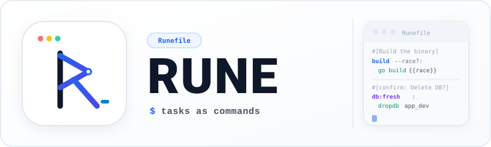

<p align="center">
  
</p>

<p align="center">
  <a href="https://go.dev">
    
  </a>
  <a href="https://github.com/octopyid/rune/releases">
    
  </a>
  <a href="https://github.com/octopyid/rune/releases">
    
  </a>
  <a href="https://github.com/octopyid/rune/actions/workflows/ci.yml">
    
  </a>
  <a href="https://github.com/octopyid/rune/blob/main/LICENSE">
    
  </a>
</p>

---

## About Rune

`rune` is a project-local task runner written in Go. It lets you define and run project-specific tasks from a `Runefile`, with support for arguments, boolean flags, task namespaces (`db:migrate`), and per-task help menus.

Like `just`, `rune` is a command runner rather than a build system — tasks run sequentially without file dependency graphs or `.PHONY` boilerplate.

```bash
rune build --race        # pass boolean flags directly
rune db:migrate          # run tasks organized by namespace
rune --dry-run release   # inspect the execution plan without running commands
rune compose up --build  # forward passthrough arguments to underlying tools
```

> [!NOTE]
> `rune` searches for a `Runefile` starting from the current directory and traversing parent directories, so you can invoke tasks from any subdirectory within your project.

---

## Key Features

- **Namespaced Tasks** — Organize related tasks under namespaces (e.g. `rune db:migrate`, `rune db:seed`).
- **Command-line Arguments, Options & Enums** — Accept positional arguments, short/long flags (`-w|--watch?`), valued options (`--output="dist"`), and enum choices (`--env=[staging,production]`).
- **Per-Task Help Menus** — Auto-generated `--help` for tasks and namespaces, with doc-comments for parameters.
- **Dependency Execution** — Run prerequisite tasks with cycle detection and deduplication.
- **Dependency Tree Inspection** — Inspect execution graphs in Unicode box-drawing format with `--tree`.
- **Private Tasks** — Hide internal or helper tasks from discovery menus using `#[private]`.
- **Interactive Safety Prompts** — Guard destructive tasks with `#[confirm: ...]` prompts before running.
- **Dry-run Mode** — Preview the resolved execution order with `--dry-run`.
- **Environment Integration** — Automatically loads `.env` files beside your `Runefile` and sets task context variables.
- **Shell Completion** — Tab completion scripts for Bash, Zsh, and Fish.

---

## Install

### Shell Script (macOS & Linux)

Install the latest pre-compiled binary into `/usr/local/bin` (or `~/.local/bin`):

```bash
curl -fsSL https://raw.githubusercontent.com/octopyid/rune/main/install.sh | sh
```

### Homebrew (macOS / Linux)

```bash
brew install octopyid/tap/rune
```

### Pre-compiled Binaries

Download standalone binaries for Linux and macOS (`amd64`, `arm64`) directly from [GitHub Releases](https://github.com/octopyid/rune/releases/latest).

### Go Install

```bash
go install github.com/octopyid/rune/cmd/rune@latest
```

### Build from Source

```bash
git clone https://github.com/octopyid/rune.git
cd rune
go build -o ./bin/rune ./cmd/rune
```

---

## Quick Start

### Prerequisites

- Go **1.22** or newer (if building from source or installing via `go install`)

### Steps

**1. Create a `Runefile` at your project root:**

```text
#[Build the application binary]
build target="dev" --race?:
    go build {{race}} -o ./bin/app ./...

#[Run unit and integration tests]
test: build
    go test ./...

#[Reset the database schema]
#[confirm: This will permanently delete all database data.]
db:fresh:
    dropdb --if-exists app_dev
    createdb app_dev

#[Forward arbitrary commands to Docker Compose]
compose *args:
    docker compose {{args}}
```

**2. Run your tasks:**

```bash
rune                           # list all available tasks
rune build                     # run with defaults
rune build production --race   # with arguments and flags
rune build --help              # auto-generated per-task help
rune --dry-run release         # simulate without executing
```

> [!TIP]
> Use `rune <namespace>` or `rune <namespace> --help` to discover tasks grouped under a namespace, for example `rune db` or `rune db --help`.

---

## Syntax at a Glance

```text
task:                     # Run a simple command
task arg:                 # Required positional argument
task env="dev":           # Positional argument with default value
task --race?:             # Optional boolean flag
task *args:               # Forward arbitrary trailing arguments
task: dep1 dep2           # Prerequisites executed before task
#[Description]            # Task summary displayed in help menu
#[confirm: Are you sure?] # Prompt user before executing task
#[dir: path/to/dir]       # Execute task in specific working directory
#[env: KEY=VAL; KEY2=V2]  # Task-scoped environment variables
#[private]                # Hide internal task from listing and autocompletion
# arg: Description        # Document argument in help menu
# --flag: Description     # Document flag in help menu
```

---

## Task Syntax

A `Runefile` consists of metadata attributes, task signatures, and indented command bodies.

```text
#[Task description]
#[confirm: Confirmation prompt]
task_name [arguments...] [--flags...] [*passthrough] : [dependencies...]
    command 1
    command 2
```

| Element | Description |
| :--- | :--- |
| `#[...]` | Metadata — attaches description or safety prompt to the next task |
| `# ` | Comment — ignored entirely |
| Signature | Non-indented line ending with `:` (or `: dep1 dep2`) |
| Commands | Lines indented with 4 spaces or a tab |
| `{{var}}` | Interpolation — expands to the resolved argument or flag value |

### Arguments

#### Required Positional

```text
greet name:
    echo "Hello, {{name}}!"
```

```bash
rune greet Supian
# Output: Hello, Supian!
```

If a required argument is omitted, Rune displays an actionable error:

```text
✗ Missing argument: name

Usage:
  rune greet <name>
```

#### Default Arguments

Assign a default value using `=` (supports quoted or unquoted values):

```text
build target="dev":
    echo "Building for target: {{target}}"
```

```bash
rune build             # Building for target: dev
rune build production  # Building for target: production
```

> **Note**: Required arguments must always precede default arguments in the signature.

### Flags & Options

Declare task CLI options using boolean flags or valued options. Single-character short aliases can be paired with long option names using pipe syntax (`-<short>|--<long>`).

#### Signature & Behaviour Matrix

| Signature Syntax | Parameter Type | Status | Default | CLI Invocation | Value in `{{var}}` | Validation / Error |
| :--- | :--- | :--- | :--- | :--- | :--- | :--- |
| `target` | Positional Argument | **Required** | - | `rune task app.go` | `"app.go"` | Error if omitted |
| `target="dev"` | Positional Argument | **Optional** | `"dev"` | `rune task`<br>`rune task prod` | `"dev"`<br>`"prod"` | - |
| `action=[up,down]="up"` | Positional Enum | **Optional** | `"up"` | `rune task`<br>`rune task down` | `"up"`<br>`"down"` | Error if value not in choices |
| `action=[up,down]` | Positional Enum | **Required** | - | `rune task up` | `"up"` | Error if omitted or not in choices |
| `-w\|--watch?` or `--watch?` | Boolean Flag | **Optional** | `false` | `rune task`<br>`rune task -w`<br>`rune task --watch` | `""` *(omitted)*<br>`"--watch"`<br>`"--watch"` | - |
| `-t\|--token=` or `--token=` | String Option | **Required** | - | `rune task -t sec123`<br>`rune task --token=sec123` | `"sec123"`<br>`"sec123"` | Error if omitted or passed without value |
| `-o\|--output="dist"` | String Option | **Optional** | `"dist"` | `rune task`<br>`rune task -o bin`<br>`rune task --output=bin` | `"dist"`<br>`"bin"`<br>`"bin"` | Error if passed without value |
| `-t\|--tag=?` | String Option | **Optional** | `""` | `rune task`<br>`rune task -t v1.0` | `""`<br>`"v1.0"` | Error if passed without value |
| `-e\|--env=[stg,prod]` | Enum Option | **Required** | - | `rune task -e stg`<br>`rune task --env=prod` | `"stg"`<br>`"prod"` | Error if omitted or not in choices |
| `-m\|--mode=[a,b]="a"` | Enum Option | **Optional** | `"a"` | `rune task`<br>`rune task -m b` | `"a"`<br>`"b"` | Error if not in choices |
| `*args` | Passthrough Args | **Optional** | `[]` | `rune task --extra "val"` | Passthrough list | - |

#### 1. Boolean Flags (Switches)

Options declared without `=` are boolean switches (`true`/`false`):

```text
build -w|--watch? target="dev":
    go build {{watch}} ./...
```

```bash
rune build                   # watch is false (expands to nothing)
rune build -w                # watch is true (expands to --watch)
rune build --watch           # watch is true (expands to --watch)
rune build -w=false          # watch is false
```

#### 2. Valued Options

Options declared with `=` accept string values. Both space and `=` syntax are supported:

```text
build -o|--output="dist" target="main.go":
    go build -o {{output}}/app {{target}}
```

```bash
rune build                   # output defaults to "dist"
rune build -o bin            # output is "bin"
rune build --output=bin      # output is "bin"
```

#### 3. Enum Choices Validation

Constrain options or positional arguments to allowed values with `[choice1,choice2]`. Rune automatically validates inputs and rejects invalid values before running commands:

```text
deploy -e|--env=[staging,production] -m|--mode=[rolling,canary]="rolling":
    ./deploy.sh --target={{env}} --strategy={{mode}}
```

```bash
# Valid invocations
rune deploy -e staging
rune deploy --env=production --mode=canary

# Invalid enum value fails fast with a clear error:
rune deploy -e local
# ✗ Invalid value "local" for option -e, --env=VALUE
# Allowed choices: staging, production
```

Positional parameters also support enum choices (e.g. `db:migrate action=[up,down,status]="up":`).

If you mistype an option, Rune suggests the closest candidate:

```bash
rune build --rce
# ✗ Unknown option: --rce
# Did you mean: --race
```

### Passthrough Arguments (`*args`)

When an underlying tool accepts arbitrary arguments, declare an explicit passthrough parameter using `*<name>`:

```text
compose *args:
    docker compose {{args}}
```

```bash
rune compose exec api sh -c "echo 'Health check'" --user=root
```

### Documenting Arguments & Options (Doc-Comments)

Document task parameters and options by placing a contiguous comment block directly before the task header:

- **Options with short aliases**: Use `# -s|--option: Description`, `# --option: Description`, or `# -s: Description` (all formats bind to the same option and share the description across `--help` and autocomplete).
- **Positional arguments**: Use `# <arg>: Description`.
- **Passthrough arguments**: Use `# *<args>: Description` or `# <args>: Description`.

```text
#[Deploy application to cloud infrastructure]
# -e|--env: Target cloud environment
# -o|--output: Build output folder
# -w|--watch: Watch file changes
# target: Entrypoint package
deploy -e|--env=[staging,production] -o|--output="dist" -w|--watch? target="./cmd/app":
    ./deploy.sh
```

Running `rune deploy --help` automatically renders these descriptions, choices, defaults, and required markers:

```text
Arguments:
  target                  Entrypoint package [default: "./cmd/app"]

Options:
  -e, --env=VALUE         Target cloud environment [choices: staging, production] (required)
  -o, --output=VALUE      Build output folder [default: "dist"]
  -w, --watch             Watch file changes
  -h, --help              Display help for the given command
  -v, --version           Display this application version
```

> **Note**: Comments that do not match declared parameter names (such as developer notes `# NOTE: ...` or `# TODO: ...`), comments separated by blank lines, and comments inside the task body are completely ignored.

### Working Directory (`#[dir]`)

Set a task-specific working directory with `#[dir: <path>]`:

```text
#[dir: frontend]
build:web:
    npm run build

#[dir: backend]
build:api:
    go build -o ../bin/api ./...
```

- Paths are relative to the directory containing the `Runefile` (or absolute if specified).
- Rune configures the process working directory directly without injecting shell `cd` commands.
- Rune validates that the directory exists before executing the task.
- Dependencies retain their own working directory configuration.

### Environment Variables (`#[env]`)

Declare task-scoped environment variables using `#[env: ...]`. Both single-line and semicolon-separated formats are supported, and multiple `#[env]` attributes accumulate:

```text
#[env: GOOS=linux]
#[env: CGO_ENABLED=0]
build:linux:
    go build -o ./bin/app-linux ./...
```

Equivalently in a single attribute:

```text
#[env: CGO_ENABLED=0; GOOS=linux]
build:linux:
    go build -o ./bin/app-linux ./...
```

- Task-scoped variables override inherited process environment variables and `.env` values for that task.
- Dependencies maintain their own isolated task environments.

### Private Tasks (`#[private]`)

Hide internal helper or prerequisite tasks from public discovery menus (`rune`, `rune list`, and shell completions) using `#[private]`:

```text
#[private]
ensure:certs:
    ./scripts/generate-certs.sh

deploy: ensure:certs
    ./scripts/deploy.sh
```

- Private tasks do not appear in `rune` or `rune --help` command listings.
- Private tasks remain fully executable when invoked directly by name (`rune ensure:certs`).
- Private tasks can be freely referenced as dependencies by other tasks.
- If all tasks in a namespace are private, the namespace itself is hidden from the root command list.

### Terminal I/O & Process Execution

`rune` connects child processes directly to the terminal's standard streams (`stdin`, `stdout`, `stderr`):

- **Interactive Commands** — Programs such as `python`, `psql`, `ssh`, and text editors receive interactive terminal input directly.
- **Signal Forwarding** — Common POSIX signals (`SIGINT`, `SIGTERM`, `SIGHUP`) are forwarded to the running command process.
- **Exit Code Preservation** — Propagates the exact exit code of the executed command.
- **Unix Pipes** — Tasks can participate in standard Unix pipes from your shell:

```bash
cat dump.sql | rune db:import
rune compose ps | grep running
```

> [!NOTE]
> `rune` executes each command directly via `os/exec` without an implicit shell. If you need shell features such as pipes (`|`) or logical operators (`&&`), run them through `sh -c "..."`.

---

## Features

### Namespaces

Group related tasks using colon notation (`namespace:task`):

```text
db:migrate:
    migrate -path ./migrations -database "$DATABASE_URL" up

db:seed:
    go run ./cmd/seed

db:fresh:
    dropdb --if-exists app_dev
    createdb app_dev
```

Namespaces act like command groups:

```bash
rune db        # discover tasks inside the 'db' namespace
rune db --help
```

```text
Namespace:
  db

Usage:
  rune db:<task> [arguments] [flags]

Available Tasks:
  fresh    Reset the database schema
  migrate  Run database migrations
  seed     Seed the database
```

### Dependencies

Specify task dependencies on the signature line after the colon:

```text
build:
    go build ./...

test: build
    go test ./...

release: build test
    ./release.sh
```

| Behavior | Description |
| :--- | :--- |
| **Deterministic Ordering** | Dependencies execute before their dependent task |
| **Deduplication** | A task runs once even if multiple tasks depend on it |
| **Cycle Detection** | Circular dependencies are detected before any command runs |
| **Fail-Fast** | Non-zero exit code halts execution immediately |

### Confirmation & Safety

Protect dangerous actions with `#[confirm: message]`:

```text
#[Reset the database schema]
#[confirm: This will permanently delete all database data.]
db:fresh:
    dropdb --if-exists app_dev
    createdb app_dev
```

```text
  WARN  This will permanently delete all database data.

  Continue?
  ❯ Yes    No
```

| Key | Action |
| :--- | :--- |
| `←` / `→`, `Tab`, `h` / `l` | Toggle selection |
| `Enter` or `Space` | Execute selected choice |
| `y` | Confirm immediately |
| `n`, `Esc`, `Ctrl+C` | Cancel |

Confirmation occurs **before any task in the dependency graph executes**. In non-interactive environments (CI, pipes), Rune falls back to line-based `Continue? [y/N]` input.

To skip confirmation entirely:

```bash
rune --yes db:fresh   # or -y
```

### Dry Run

Simulate execution and inspect the resolved command sequence without running anything:

```bash
rune --dry-run release
```

```text
[dry-run] Execution plan for 'release':
  1. build
     $ go build ./...
  2. test
     $ go test ./...
  3. release
     $ ./release.sh
```

### Dependency Tree (`--tree`)

Inspect the hierarchical dependency tree of a task or the entire `Runefile` without executing any commands:

```bash
rune release --tree
# or: rune --tree release
```

```text
release
├── build (dir: backend)
└── test
    ├── setup:certs [private]
    └── build (dir: backend) (deduped)
```

- **Box-Drawing Tree**: Uses standard Unicode box-drawing characters (`├──`, `└──`, `│   `).
- **Deduplication (`(deduped)`)**: Tasks already expanded earlier in the tree are marked as `(deduped)` to avoid redundant sub-branches.
- **Context Badges**: Highlights task attributes inline such as `[private]` and `(dir: <path>)`.
- **Project-Wide Overview**: Run `rune --tree` without a task name to visualize dependency trees for all tasks in your `Runefile`:

```bash
rune --tree
```

### Environment Handling

| Variable | Description |
| :--- | :--- |
| Auto `.env` loading | Loaded automatically if `.env` exists beside the `Runefile` |
| `RUNE_TASK` | Name of the active task (e.g. `build`) |
| `RUNE_ARG_<NAME>` & `<NAME>` | Value of resolved positional arguments |
| `RUNE_FLAG_<NAME>` | Set to `1` when the flag is enabled |

Child processes also inherit the full system environment (`os.Environ()`).

### Verbose Output (`--verbose`)

Display each command before executing it:

```bash
rune build --verbose
```

```text
$ go build -o ./bin/app ./...
```

- Does not alter command arguments, environment, or execution flow.
- Command arguments with spaces or quotes are cleanly escaped.

### Execution Timing (`--time`)

Display execution duration for tasks:

```bash
rune test --time
```

Output for tasks with dependencies:

```text
[1/3] test:unit        0.82s
[2/3] test:feature     1.45s
[3/3] test:e2e         3.21s

✔ Total: 5.48s
```

Combine with `--verbose`:

```bash
rune build --verbose --time
```

```text
$ go build -o ./bin/app ./...

✔ build (0.82s)

Total: 0.82s
```

---

## Console UI Components

Rune includes built-in console UI components for use directly from the shell or inside your `Runefile` task recipes.

| Command | Badge | Color | Exit Code | Purpose |
| :--- | :--- | :--- | :--- | :--- |
| `rune info <msg>` | `INFO` | Blue bg, white bold | `0` | Informational status updates |
| `rune warn <msg>` | `WARN` | Yellow bg, black bold | `0` | Warnings or cautionary alerts |
| `rune done <msg>` | `DONE` | Green bg, white bold | `0` | Successful completions (alias: `rune success`) |
| `rune fail <msg>` | `FAIL` | Red bg, white bold | `1` | Task or validation failure alerts |
| `rune error <msg>` | `ERROR` | Red bg, white bold | `1` | System error or fatal exception alerts |

Example usage in a `Runefile`:

```text
#[Deploy application to production]
#[confirm: Are you sure you want to deploy to production?]
deploy:
    rune info "Preparing deployment assets..."
    npm run build
    rune info "Syncing files to remote server..."
    rsync -avz ./dist/ user@example.com:/var/www/
    rune done "Deployment finished successfully!"

#[Verify system dependencies]
check:
    sh -c "test -f .env || (rune error 'Missing .env configuration file!' && exit 1)"
    sh -c "git diff --quiet || (rune fail 'Working directory has unstaged changes!' && exit 1)"
    rune done "All checks passed."
```

Output:

```text
  INFO  Preparing deployment assets...

  DONE  Deployment finished successfully!
```

> **Task Precedence**: If your `Runefile` defines a custom task named `info`, `warn`, `error`, `fail`, or `done`, your custom task takes precedence over the built-in component.

---

## Shell Completion

Rune provides tab completion for Bash, Zsh, and Fish.

### Zsh

Add to your `~/.zshrc`:

```bash
source <(rune completion zsh)
```

### Bash

Add to your `~/.bashrc`:

```bash
source <(rune completion bash)
```

### Fish

Add to your `~/.config/fish/config.fish`:

```fish
rune completion fish | source
```

### What Gets Completed

| Input | Completion |
| :--- | :--- |
| `rune bu<TAB>` | `build` |
| `rune d<TAB>` | `db` |
| `rune build --<TAB>` | `--race` |
| `rune in<TAB>` | `info`, `warn`, `done`, `error`, `help`, `list` |
| `rune --<TAB>` | `--dry-run`, `--help`, `--yes`, etc. |

---

## Editor Setup

### Visual Studio Code

To enable syntax highlighting for `Runefile` in VS Code, add the file association to your `settings.json`:

```json
"files.associations": {
    "Runefile": "makefile"
}
```

---

## Scope & Philosophy

`rune` is focused on running project-specific tasks. It is deliberately minimal and does not attempt to be:

- A build system or CI/CD engine
- A process supervisor or daemon manager
- A package manager or environment orchestrator
- A full scripting language or workflow engine

Its goal is simply to make defining, finding, and running tasks straightforward and dependable.

---

## Security

Rune is a local CLI tool. It does not collect telemetry, phone home, or require network access to operate.

**Reporting a Vulnerability:** If you discover a security issue, please follow the responsible disclosure process described in [SECURITY.md](SECURITY.md). Do not open a public GitHub issue for security vulnerabilities.

---

## Contributing

Contributions are welcome — bug reports, feature discussions, and pull requests alike. If you are new to the codebase, look for issues labeled `good first issue` as a starting point.

Before submitting a pull request, please read [CONTRIBUTING.md](CONTRIBUTING.md). It covers the code style, commit conventions, and the PR review process.

---

## License

Rune is licensed under the **MIT License**. See [LICENSE](LICENSE) for the full license text.
